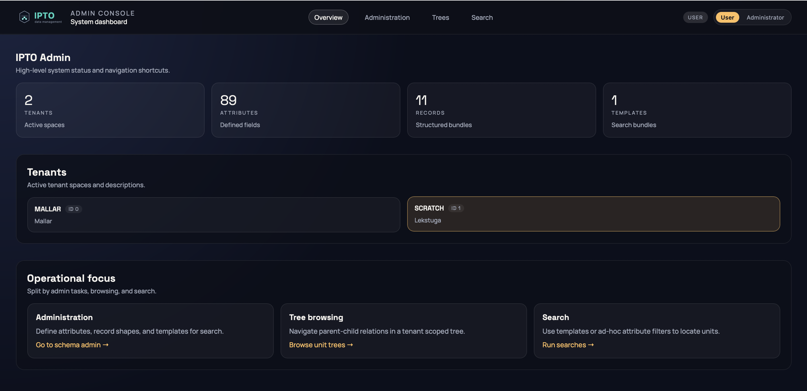
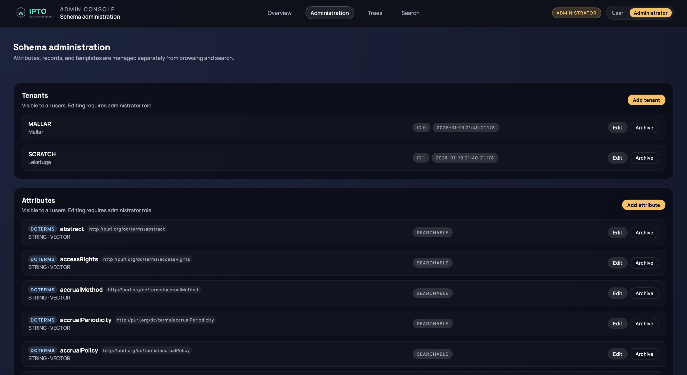
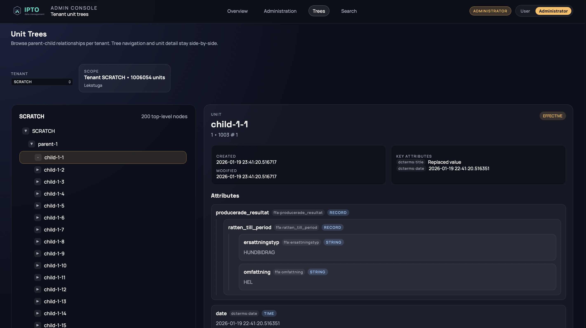

# IPTO - An auto-configured data management platform

[](https://deepwiki.com/FrodeRanders/ipto)

IPTO is a data management framework that treats GraphQL Schema Definition Language (SDL) as 
executable configuration. Instead of writing code to define data models, schemas, and 
persistence logic, developers declare their domain model using GraphQL SDL with custom 
directives, and the system automatically generates a complete data management solution 
with full versioning, multi-tenancy, and search capabilities.

IPTO solves the problem of managing structured metadata in systems where the schema 
evolves over time or varies across different use cases. Rather than creating database tables 
for each entity type, IPTO uses an Entity-Attribute-Value (EAV) pattern with type-specific 
storage optimizations. 

IPTO exposes two interfaces for data interaction, each serving different use cases:
* The GraphQL API (the ```ipto-graphql``` module) provides declarative data access through standard 
GraphQL queries and mutations. The API surface is automatically generated from the SDL 
schema, ensuring type safety and schema alignment.
* The Java API (the ```ipto-repo``` module) provides programmatic access through the Repository 
interface for applications that need fine-grained control or operate in non-GraphQL contexts.

Details on setup and configuration:
* [Setup](doc/Setup.md)
* [Configuration](doc/Configuration.md)
* [Using GraphQL for retrieving data](doc/Retrieving_using_GraphQL.md)
* [Using Java for creating and retrieving data](doc/Using_Java.md)

## Administration UI
Overview tab


Attributes administration tab


Trees tab


Search tab

