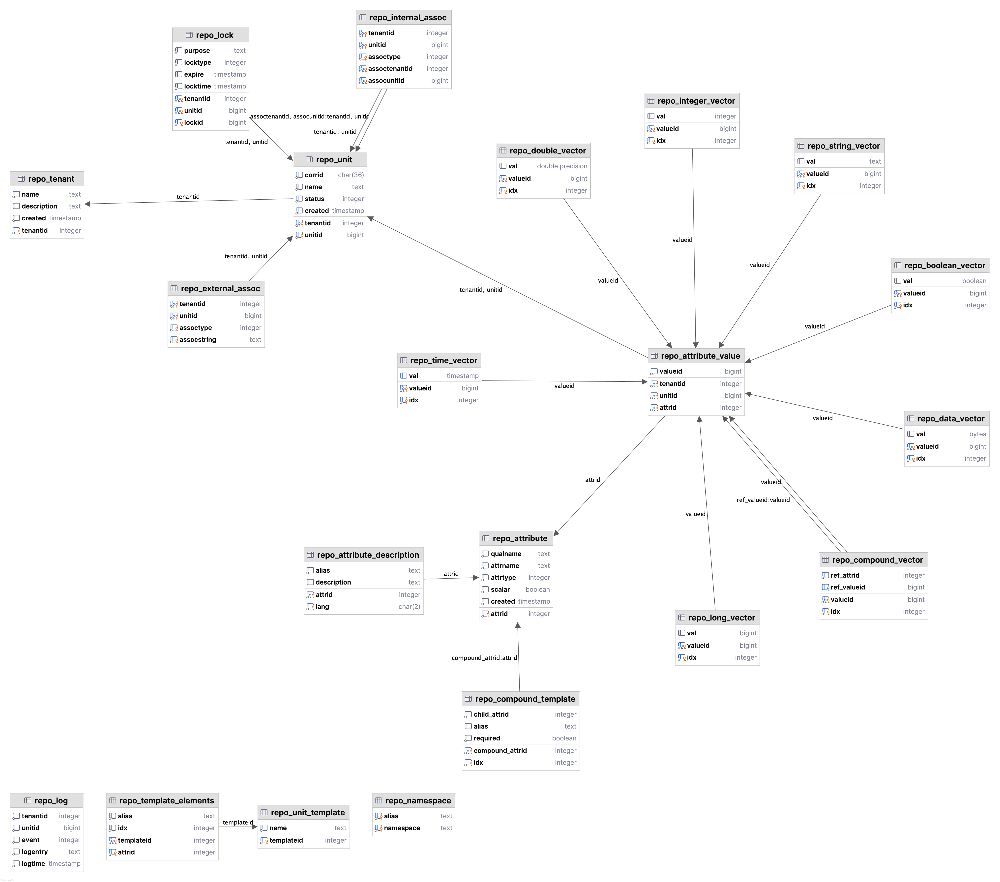

# IPTO - A metadata management framework

A metadata management system around 'units'. Units are immutable entities that can encapsulate dynamic sets of metadata.

See end of README for instructions on how to setup test.

## Configuration
Configuration of attributes (using GraphQL SDL):
```graphql
##############  directive definitions ############################
directive @datatypeRegistry on ENUM
directive @datatype(id: Int!, basictype: String = null) on ENUM_VALUE

directive @attributeRegistry on ENUM
directive @attribute(id: Int!, datatype: DataTypes!, vector: Boolean = false, alias: String = null, uri: String = null, description: String = null) on ENUM_VALUE

directive @use(attribute: Attributes!) on FIELD_DEFINITION
directive @unit(id: Int!) on OBJECT
directive @record(attribute: Attributes!) on OBJECT

##############  builtin data types, provided for reference #######
enum DataTypes @datatypeRegistry {
    STRING    @datatype(id: 1,  basictype: "text")
    TIME      @datatype(id: 2,  basictype: "timestamptz")
    INTEGER   @datatype(id: 3,  basictype: "int")
    LONG      @datatype(id: 4,  basictype: "bigint")
    DOUBLE    @datatype(id: 5,  basictype: "double precision")
    BOOLEAN   @datatype(id: 6,  basictype: "boolean")
    DATA      @datatype(id: 7,  basictype: "bytea")
    RECORD    @datatype(id: 99)
}

##############  attributes #######################################
enum Attributes @attributeRegistry {
    TITLE @attribute(id: 1, datatype: STRING, vector: false,
        alias: "dc:title", uri: "http://purl.org/dc/elements/1.1/title")
    ...
    ORDER_ID  @attribute(id: 1001, datatype: STRING)
    DEADLINE  @attribute(id: 1002, datatype: TIME)
    READING   @attribute(id: 1003, datatype: DOUBLE, vector: true)
    SHIPMENT  @attribute(id: 1099, datatype: RECORD)
}

##############  object & unit types ##############################
scalar DateTime     # maps to timestamptz  (java.time.Instant)

type Shipment @record(attribute: SHIPMENT) {
    orderId  : String    @use(attribute: ORDER_ID)
    deadline : DateTime  @use(attribute: DEADLINE)
    reading  : [Float]   @use(attribute: READING)
}

type PurchaseOrder @unit(id: 42) {
    orderId  : String    @use(attribute: ORDER_ID)
    ...
    shipment : Shipment  @use(attribute: SHIPMENT)
}
```

## Example of usage:
```java
    public void createAUnitAndAssignAttributes() {
        Repository repo = RepositoryFactory.getRepository();
        int tenantId = getTenantId("SCRATCH", repo); // SCRATCH is the default space

        // Create a unit, with some random name. Names does not have to be unique
        // as they are not used to identify units.
        Unit unit = repo.createUnit(tenantId, "a shipment instance");

        unit.withAttributeValue("dc:title", String.class, value -> {
            value.add("Shipment information for *order id*");
        });
    
        unit.withAttribute("SHIPMENT", Attribute.class, attr -> {
            RecordAttribute recrd = new RecordAttribute(attr);

            recrd.withNestedAttributeValue(unit, "ORDER_ID", String.class, value -> {
                value.add("*order id*");
            });

            recrd.withNestedAttributeValue(unit, "DEADLINE", Instant.class, value -> {
                value.add(Instant.now()); // brutal :)
            });

            recrd.withNestedAttributeValue(unit, "READING", Double.class, value -> {
                value.add(Math.PI);
                value.add(Math.E);
            });
        });

        // Store this new unit to database
        repo.storeUnit(unit);
    }

    public void searchForAUnitBasedOnAttributes() {
        Repository repo = RepositoryFactory.getRepository();
        int tenantId = getTenantId("SCRATCH", repo); // SCRATCH is the default space

        // Constraints specified for the unit itself (such as being 'EFFECTIVE')
        SearchExpression expr = new SearchExpression(SearchItem.constrainToSpecificTenant(tenantId));
        expr = SearchExpression.assembleAnd(expr, SearchItem.constrainToSpecificStatus(Unit.Status.EFFECTIVE));

        // Constrain to specific string attribute, in this case 'order ID'
        attributeId = getAttributeId("ORDER_ID", repo);
        SearchItem<String> stringSearchItem = new StringAttributeSearchItem(attributeId, Operator.EQ, "*order id*");
        expr = SearchExpression.assembleAnd(expr, stringSearchItem);

        // 
        SearchOrder order = SearchOrder.getDefaultOrder(); // descending on creation time
 
        // Now we can *either* use canned search (that produces instantiated Unit:s) 
        // *or* search without instantiating Unit objects.
        if (/* use canned search? */ true) {
            SearchResult result = repo.searchUnit(
                    /* paging stuff */ 0, 5, 100,
                    expr, order
            );

            Collection<Unit> units = result.results();
            for (Unit unit : units) {
                System.out.println("Found: " + unit);
            }
            
        } else {
            // Searching without instantiating Unit:s.
            DatabaseAdapter searchAdapter = repo.getDatabaseAdapter();
            UnitSearchData usd = new UnitSearchData(expr, order, /* selectionSize */ 5);

            try {
                repo.withConnection(conn -> searchAdapter.search(conn, usd, repo.getTimingData(), rs -> {
                    while (rs.next()) {
                        int i = 0;
                        int _tenantId = rs.getInt(++i);
                        long _unitId = rs.getLong(++i);
                        Timestamp _created = rs.getTimestamp(++i);

                        System.out.println("Found: tenantId=" + _tenantId + " unitId=" + _unitId + " created=" + _created);
                    }
                }));
            } catch (SQLException sqle) {
                throw new RuntimeException("Could not search: " + Database.squeeze(sqle), sqle);
            }
        }
    }

    /* Utility function, tenant name -> tenant id */
    private int getTenantId(String tenantName, Repository repo) {
        Optional<Integer> tenantId = repo.tenantNameToId(tenantName);
        if (tenantId.isEmpty()) {
            throw new RuntimeException("Unknown tenant: " + tenantName);
        }
        return tenantId.get();
    }

    /* Utility function, attribute name -> attribute id */
    private int getAttributeId(String attributeName, Repository repo) {
        Optional<Integer> attributeId = repo.attributeNameToId(attributeName);
        if (attributeId.isEmpty()) {
            throw new RuntimeException("Unknown attribute: " + attributeName);
        }
        return attributeId.get();
    }
```

## Database
The data model governed by this framework:


## Setup
The steps needed in order to fetch, start and configure PostgreSQL to run in a Docker container are 
automated in ```db/postgresql/setup-for-test.py```, but you can do this manually (as described in [this README](db/postgresql/README.md)).

```
➜  python db/postgresql/setup-for-test.py
Pulling the latest 'postgres' image from Docker Hub...
Using default tag: latest
latest: Pulling from library/postgres
254e724d7786: Pull complete
...

Image pulled successfully.

Removing existing container named 'repo-postgres' (if any)...
Removed old container 'repo-postgres'.

Starting new container 'repo-postgres' on port 1402 ...
2e8b41855a8976901ed256cba75c6541c3dda188a4cb617f911688c26057212b
Container started.

Waiting 10 seconds for the database to initialize...
Proceeding...

Entering container to run psql commands...
...

Setup completed.  
```
