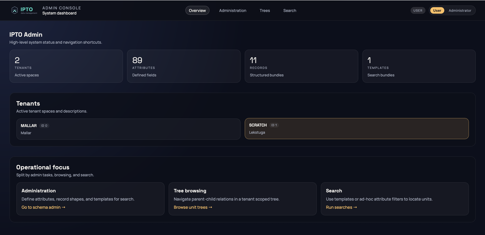
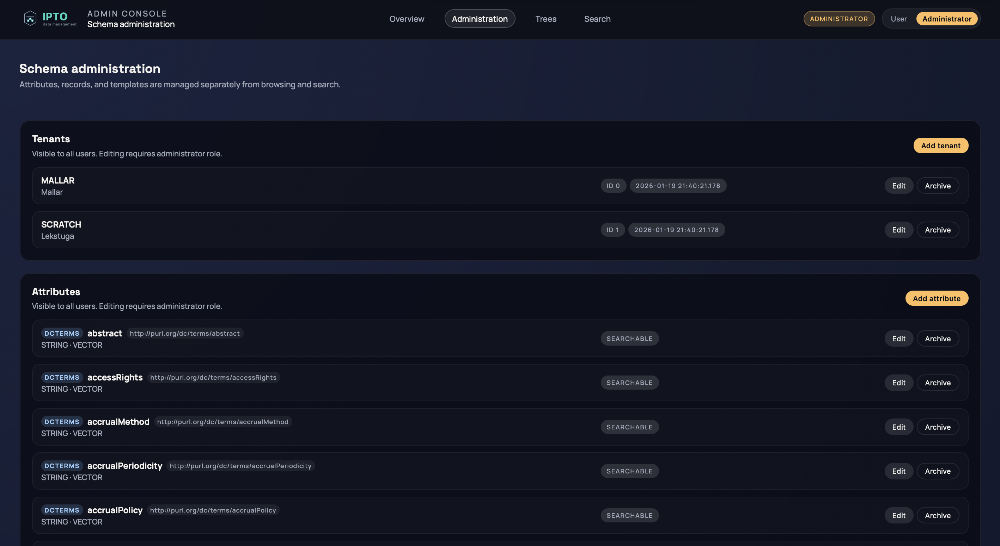
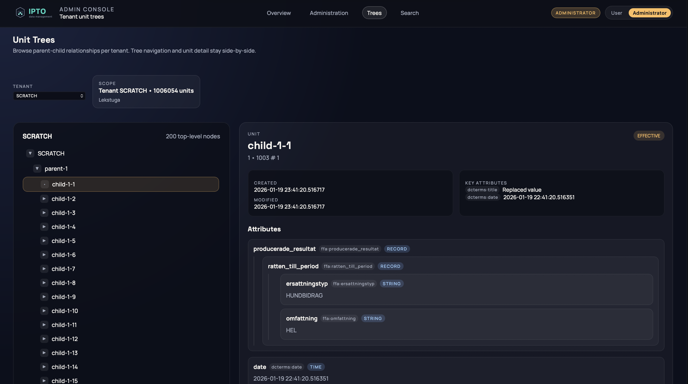
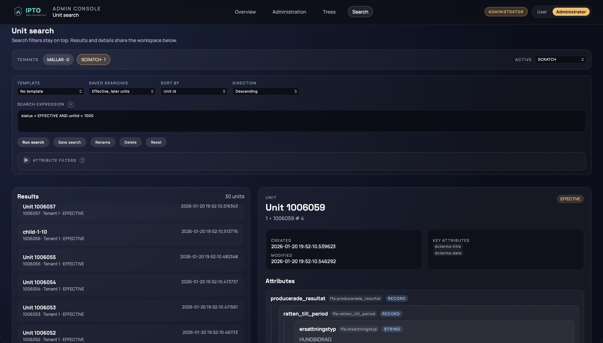

# IPTO - An auto-configured data management platform

## What is this?
This Java project implements management of data as versioned `units`, where each version
binds to a number of typed attributes. These attributes can be `primitive`, meaning that
they only hold values of one type (string, boolean, instants, and so on), or they can be
`records`, meaning that they hold a list of nested attributes -- even records. Units
have lifecycle, while records do not. Records are a type of attribute.

This makes it possible to model complex objects with nested structure, given that the
types of primitive attributes are sufficient. One such attribute type is `data` that
maps to a series of bytes, which can be used to store JSON.

By default, and internally, attribute values are vectors, so you have vectors of string,
vectors of integers, vectors of instants, vectors of records and even vectors of data.

Additionally, units can have locks and relations to other units. There are some different
types of relations implemented, such as parent-child-relation that can be used to create
a directory with units type of structure. Units can also have associations to external
entities, identified by some string.

Units are identified (and enumerated) by a combination of `tenantId`, `unitId`, and
possibly a version-number (or else assuming latest version). Units also have a
`correlationId` (UUID) that uniquely identify a unit.

The project has a search facility, that abstracts the actual generation of SQL. You
either assemble object `search expressions` by a hierarchy of `search items`, practically
an AST, or you provide textual search expressions that are then parsed into the
former. The search API then uses the AST to generate SQL, either literal SQL for JDBC
statements (which may be subject to SQL injection, so beware) or SQL together with
parameters for JDBC prepared statements.

Configuration of attributes (including records) is done using GraphQL SDL, but you
may choose not to use GraphQL as an API if you don't want this. Together with the
native Java API and the mentioned search facility, you can implement what you need.
If you do accept GraphQL for API, the resolvers are mostly generated dynamically.
If you need more control over format of queries and mutations, you may have to
provide a custom resolver, which is relatively easy.

There is a web-based user interface that uses Svelte, which lets you browse what
structure may be or search using the textual representation from the search facility.

There is also a Quarkus-based application that exposes an API used as backend to the
web interface, that also exposes a HTTP endpoint for GraphQL.

Additionally, there is a separate Erlang implementation of the core functionality,
where the search facility is a bit simplified as compared to the Java version.

## The layout of this project:

- `./repo` contains the Java core functionality, which is plain Java (no CDI) and JDBC.
- `./db/postgresql` contains PostgreSQL specific parts (schema, initial data, ...).
- `./db/db2` contains DB2 (LUW-version) specific parts (schema, initial data, ...).
- `./db/java` contains some things that DB2 needs, but is generic JDBC.
- `./graphql` contains the GraphQL part for configuration and query/mutation (if needed).
- `./repo-cdi` contains setup/boot functionality using CDI.
- `./quarkus-app` contains a Quarkus application that exposes HTTP endpoints.
- `./it` contains integration tests.
- `./erl` contains a separate Erlang implementation of the stuff in `./repo` (and `./graphql`).

The Erlang version stores data to either PostgreSQL or Neo4j.

## For developers
IPTO is a data management framework that treats GraphQL Schema Definition Language (SDL) as 
configuration. Instead of writing code to define data models, schemas, and 
persistence logic, developers declare their domain model using GraphQL SDL with custom 
directives, and the system automatically generates a data management solution 
with full versioning, multi-tenancy, and search capabilities... but no authorisation.
Authorisation has to be implemented outside of this solution, preferably by a
reverse-proxy configuration.

IPTO solves the problem of managing structured metadata in systems where the schema 
evolves over time or varies across different use cases. Rather than creating database tables 
for each entity type, IPTO uses an Entity-Attribute-Value (EAV) pattern with type-specific 
storage optimizations. 

IPTO exposes two interfaces for data interaction, each serving different use cases:
* The GraphQL API (the `graphql` module) provides declarative data access through standard 
GraphQL queries and mutations. The API surface is automatically generated from the SDL 
schema, ensuring type safety and schema alignment.
* The Java API (the `repo` module) provides programmatic access through the Repository 
interface for applications that need fine-grained control or operate in non-GraphQL contexts.

## Details on setup and configuration:
* [Setup](doc/Setup.md)
* [Configuration](doc/Configuration.md)
* [Using GraphQL for retrieving data](doc/Retrieving_using_GraphQL.md)
* [Using Java for creating and retrieving data](doc/Using_Java.md)

## Administration UI
Screen dumps of administration user interface

Overview tab

Attributes administration tab

Trees tab

Search tab

