# Data model

## Model

```mermaid
erDiagram
    REPO_TENANT {
        INT TENANTID PK
        VARCHAR(256) NAME UK
        CLOB(1M) DESCRIPTION
        TIMESTAMP CREATED
    }

    REPO_UNIT_KERNEL {
        INT TENANTID PK, FK
        BIGINT UNITID PK
        CHAR(36) CORRID UK
        INT STATUS
        INT LASTVER
        TIMESTAMP CREATED
    }

    REPO_UNIT_VERSION {
        INT TENANTID PK, FK
        BIGINT UNITID PK, FK
        INTEGER UNITVER PK
        VARCHAR(255) UNITNAME
        TIMESTAMP MODIFIED
    }

    REPO_NAMESPACE {
        VARCHAR(128) ALIAS PK
        VARCHAR(512) NAMESPACE PK
    }

    REPO_ATTRIBUTE {
        INT ATTRID PK
        VARCHAR(512) QUALNAME UK
        VARCHAR(256) ATTRNAME UK
        VARCHAR(256) ALIAS
        INT ATTRTYPE
        BOOLEAN SCALAR
        TIMESTAMP CREATED
    }

    REPO_ATTRIBUTE_DESCRIPTION {
        INT ATTRID PK, FK
        CHAR(2) LANG PK
        VARCHAR(256)NOT ALIAS
        CLOB(1M) DESCRIPTION
    }

    REPO_ATTRIBUTE_VALUE {
        INT TENANTID PK, FK
        BIGINT UNITID PK, FK
        INT ATTRID PK, FK
        BIGINT VALUEID PK, UK
        INTEGER UNITVERFROM PK, FK
        INTEGER UNITVERTO FK
    }

    REPO_UNIT_TEMPLATE {
        INT TEMPLATEID PK
        VARCHAR(256) NAME UK
    }

    REPO_UNIT_TEMPLATE_ELEMENTS {
        INT TEMPLATEID PK, FK
        INT ATTRID PK
        INT IDX
        VARCHAR(256) ALIAS
    }

    repo_record_template {
        INT RECORDID PK, FK
        VARCHAR(256) NAME UK
    }

    repo_record_template_elements {
        INT RECORDID PK, FK
        INT ATTRID PK, FK
        INT IDX
        VARCHAR(256) ALIAS
    }

    REPO_STRING_VECTOR {
        BIGINT VALUEID PK, FK
        INT IDX PK
        VARCHAR(512) VALUE
    }

    REPO_TIME_VECTOR {
        BIGINT VALUEID PK, FK
        INT IDX PK
        TIMESTAMP VALUE
    }

    REPO_INTEGER_VECTOR {
        BIGINT VALUEID PK, FK
        INT IDX PK
        INT VALUE
    }

    REPO_LONG_VECTOR {
        BIGINT VALUEID PK, FK
        INT IDX PK
        BIGINT VALUE
    }

    REPO_DOUBLE_VECTOR {
        BIGINT VALUEID PK, FK
        INT IDX PK
        DOUBLE VALUE
    }

    REPO_BOOLEAN_VECTOR {
        BIGINT VALUEID PK, FK
        INT IDX PK
        BOOLEAN VALUE
    }

    REPO_DATA_VECTOR {
        BIGINT VALUEID PK, FK
        INT IDX PK
        BLOB(1M) VALUE
    }

    REPO_RECORD_VECTOR {
        BIGINT VALUEID PK, FK
        INT IDX PK
        INT REF_ATTRID
        BIGINT REF_VALUEID FK
    }

    REPO_LOG {
        INT TENANTID
        BIGINT UNITID
        INTEGER UNITVER
        INT EVENT
        VARCHAR(256) LOGENTRY
        TIMESTAMP LOGTIME
    }

    REPO_LOCK {
        INT TENANTID PK, FK
        BIGINT UNITID PK, FK
        BIGINT LOCKID PK
        VARCHAR(256) PURPOSE
        INT LOCKTYPE
        TIMESTAMP EXPIRE
        TIMESTAMP LOCKTIME
    }

    REPO_INTERNAL_RELATION {
        INT TENANTID PK, FK
        BIGINT UNITID PK, FK
        INT RELTYPE PK
        INT RELTENANTID PK, FK
        BIGINT RELUNITID PK, FK
        TIMESTAMP CREATED
    }

    REPO_EXTERNAL_ASSOC {
        INT TENANTID PK, FK
        BIGINT UNITID PK, FK
        INT ASSOCTYPE PK
        VARCHAR(256) ASSOCSTRING PK
        TIMESTAMP CREATED
    }

    REPO_TENANT ||--o{ REPO_UNIT_KERNEL : "TENANTID"
    REPO_UNIT_KERNEL ||--o{ REPO_UNIT_VERSION : "TENANTID, UNITID"
    REPO_ATTRIBUTE ||--o{ REPO_ATTRIBUTE_DESCRIPTION : "ATTRID"
    REPO_ATTRIBUTE ||--o{ REPO_ATTRIBUTE_VALUE : "ATTRID"
    REPO_UNIT_VERSION ||--o{ REPO_ATTRIBUTE_VALUE : "TENANTID, UNITID, UNITVERFROM"
    REPO_UNIT_VERSION ||--o{ REPO_ATTRIBUTE_VALUE : "TENANTID, UNITID, UNITVERTO"
    REPO_UNIT_TEMPLATE ||--o{ REPO_UNIT_TEMPLATE_ELEMENTS : "TEMPLATEID"
    REPO_ATTRIBUTE ||--o{ repo_record_template : "RECORDID"
    REPO_ATTRIBUTE ||--o{ repo_record_template_elements : "ATTRID"
    REPO_RECORD_TEMPLATE ||--o{ repo_record_template_elements : "RECORDID"
    REPO_ATTRIBUTE_VALUE ||--o{ REPO_STRING_VECTOR : "VALUEID"
    REPO_ATTRIBUTE_VALUE ||--o{ REPO_TIME_VECTOR : "VALUEID"
    REPO_ATTRIBUTE_VALUE ||--o{ REPO_INTEGER_VECTOR : "VALUEID"
    REPO_ATTRIBUTE_VALUE ||--o{ REPO_LONG_VECTOR : "VALUEID"
    REPO_ATTRIBUTE_VALUE ||--o{ REPO_DOUBLE_VECTOR : "VALUEID"
    REPO_ATTRIBUTE_VALUE ||--o{ REPO_BOOLEAN_VECTOR : "VALUEID"
    REPO_ATTRIBUTE_VALUE ||--o{ REPO_DATA_VECTOR : "VALUEID"
    REPO_ATTRIBUTE_VALUE ||--o{ REPO_RECORD_VECTOR : "VALUEID"
    REPO_ATTRIBUTE_VALUE ||--o{ REPO_RECORD_VECTOR : "REF_VALUEID"
    REPO_UNIT_KERNEL ||--o{ REPO_LOCK : "TENANTID, UNITID"
    REPO_UNIT_KERNEL ||--o{ REPO_INTERNAL_RELATION : "TENANTID, UNITID"
    REPO_UNIT_KERNEL ||--o{ REPO_INTERNAL_RELATION : "RELTENANTID, RELUNITID"
    REPO_UNIT_KERNEL ||--o{ REPO_EXTERNAL_ASSOC : "TENANTID, UNITID"
```


## Mermaid ERD generator

Print Mermaid ERD to stdout:

```
python generate_schema_mermaid.py --schema schema.sql --markdown
```

Update this README in place:

```
python generate_schema_mermaid.py --schema schema.sql --update-readme README.md
```

The script includes its own embedded README at the top of `generate_schema_mermaid.py`.

# DB2 setup

## Running DB2 in docker container

### 1. Setup

```
docker pull ibmcom/db2
```

Example output:

```
Using default tag: latest
latest: Pulling from ibmcom/db2
8dfe9326f733: Pull complete
0d875a68bf99: Pull complete
50e8fb20327b: Pull complete
a0c05fd037e6: Pull complete
1cd5cf0a05ba: Pull complete
6c97ca72f52c: Pull complete
e0c22e12ea4e: Pull complete
06fa0bd3b2ef: Pull complete
01d61e0e2f08: Pull complete
849d15abca93: Pull complete
be6ee447107f: Pull complete
408a6e6d33a2: Pull complete
a9c177505816: Pull complete
Digest: sha256:81d01c71ed0d1ae27ee51ab53133610970b25b60de385a0c1906fe53017f4c96
Status: Downloaded newer image for ibmcom/db2:latest
docker.io/ibmcom/db2:latest

mkdir /Users/froran/workingdirectory/repo/repodb
```

### 2. Running

```
docker run -itd --name devdb2 --privileged=true -p 50000:50000 -e LICENSE=accept -e DB2INST1_PASSWORD=sosecret -e DBNAME=repodb -v /Users/froran/workingdirectory/repo/repodb:/database ibmcom/db2
```

Example output:

```
e492a8de1cb26f7c4fca705e99417fcb09dcd0f80fc1e5fc90efb47ebbe465ae

docker logs -f e492a8de1cb26f7c4fca705e99417fcb09dcd0f80fc1e5fc90efb47ebbe465ae

Wait for log entries...
...
(*) All databases are now active.
(*) Setup has completed.
...
```

### 3. Retrieve JDBC type 4 driver from container and store to local maven repo

```
docker cp $(docker ps -lq):/database/config/db2inst1/sqllib/java/db2jcc4.jar .
docker cp $(docker ps -lq):/database/config/db2inst1/sqllib/java/db2jcc_license_cu.jar .

mvn install:install-file -DgroupId=ibm.db2 -DartifactId=db2jcc4 -Dversion=11.5.7 -Dpackaging=jar -Dfile=./db2jcc4.jar -DgeneratePom=true
mvn install:install-file -DgroupId=ibm.db2 -DartifactId=db2jcc4 -Dversion=11.5.7 -Dpackaging=jar -Dfile=./db2jcc_license_cu.jar -Dclassifier=license -DgeneratePom=false
```

So:

```
<dependency>
  <groupId>ibm.db2</groupId>
  <artifactId>db2jcc4</artifactId>
  <version>11.5.7</version>
</dependency>
```

There are two license files: db2jcc_license_cisuz.jar and db2jcc_license_cu.jar
- db2jcc_license_cisuz.jar contains licenses for Linux, Unix, Windows, IBM System i, and IBM System z. This variant is required if you connect to a DB2 running on z/OS.
- db2jcc_license_cu.jar comes with the 'Personal Edition' installations of DB2.

### 4. Create database

```
docker exec -ti devdb2 bash -c "su - db2inst1"
db2 create db repo
```

Example output:

```
Last login: Tue Aug 23 17:38:13 UTC 2022
db2inst1@d681e3eb7948 ~]$ db2 create db repo
DB20000I  The CREATE DATABASE command completed successfully.
```

### 5. Connect with some tool

JDBC url: jdbc:db2://localhost:50000/repo  
User: db2inst1  
Password: sosecret  
Database: repo

Issue the following SQL commands:

```
CREATE SCHEMA REPO;
SET CURRENT SCHEMA REPO;
```

### 6. Administration

```
docker exec -ti devdb2 bash -c "su - db2inst1"
db2 connect to repo
```

Example output:

```
Database Connection Information

Database server        = DB2/LINUXX8664 11.5.7.0
SQL authorization ID   = DB2INST1
Local database alias   = REPO
```

Run stats:

```
db2 reorgchk update statistics on table all
```

Example output:

```
Doing RUNSTATS ....

Table statistics:

F1: 100 * OVERFLOW / CARD < 5
F2: 100 * (Effective Space Utilization of Data Pages) > 70
F3: 100 * (Required Pages / Total Pages) > 80

SCHEMA.NAME                     CARD     OV     NP     FP ACTBLK    TSIZE  F1  F2  F3 REORG
----------------------------------------------------------------------------------------
Table: REPO.REPO_ATTRIBUTE
                                  15      0      2      2      -     3510   0  87 100 ---
Table: REPO.REPO_ATTRIBUTE_VERSION
                             2086994      0  24001  24001      - 96001728   0  99 100 ---
[..]
----------------------------------------------------------------------------------------

Index statistics:

F4: CLUSTERRATIO or normalized CLUSTERFACTOR > 80
F5: 100 * (Space used on leaf pages / Space available on non-empty leaf pages) > MIN(50, (100 - PCTFREE))
F6: (100 - PCTFREE) * (Amount of space available in an index with one less level / Amount of space required for all keys) < 100
F7: 100 * (Number of pseudo-deleted RIDs / Total number of RIDs) < 20
F8: 100 * (Number of pseudo-empty leaf pages / Total number of leaf pages) < 20

SCHEMA.NAME                 INDCARD  LEAF ELEAF LVLS  NDEL    KEYS LEAF_RECSIZE NLEAF_RECSIZE LEAF_PAGE_OVERHEAD NLEAF_PAGE_OVERHEAD  PCT_PAGES_SAVED  F4  F5  F6  F7  F8 REORG
-------------------------------------------------------------------------------------------------------------------------------------------------------------------------------
Table: REPO.REPO_ATTRIBUTE
Index: REPO.REPO_ATTRIBUTES_PK
                                 15     1     0    1     0      15            4             4                710                 710                0 100   -   -   0   0 -----
Index: REPO.REPO_ATTR_NAME_UNIQUE
                                 15     1     0    1     0      15           13            13                822                 822                0 100   -   -   0   0 -----
Index: REPO.REPO_ATTR_QUALNAME_UNIQUE
                                 15     1     0    1     0      15           42            42                822                 822                0 100   -   -   0   0 -----
Table: REPO.REPO_ATTRIBUTE_VERSION
                            2086994 23805     0    4     0 2086994           24            24                338                 338                0 100  79  36   0   0 -----
Index: REPO.REPO_AV_IND1
                            2086994  7538     0    3     0       2            4             4                710                 710                0  99  57   3   0   0 -----
Index: REPO.REPO_AV_IND2
                            2086994 17989     0    4     7 2086994           20            20                370                 370                0 100  93  50   0   0 -----
[..]
```

Reorg + stats:

```
db2 runstats on table repo.repo_attribute_version with distribution and detailed indexes all
db2 -x "select 'reorg table',substr(rtrim(tabschema)||'.'||rtrim(tabname),1,50),';' from syscat.tables where type = 'T' and tbspace='USERSPACE1'" > reorg.txt
more reorg.txt
db2 -tvf reorg.txt
```
