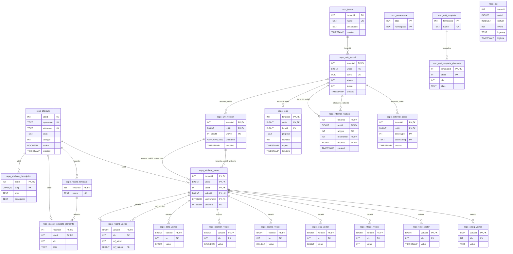

# Data model

## Model

## Mermaid ERD generator
Generate this Mermaid diagram from schema.sql:

```
python generate_schema_mermaid.py --schema schema.sql --markdown
```

Or update this README in-place:

```
python generate_schema_mermaid.py --schema schema.sql --update-readme README.md
```

The script includes its own embedded README at the top of `generate_schema_mermaid.py`.

# Instructions for retrieving, running and preparing PostgreSQL

The name of the database ('repo'), the user ('repo') and the password ('repo'), 
matches the [configuration](../../repo/src/main/resources/org/gautelis/ipto/repo/configuration_pg.xml) 
that is currently stored among the resources. This is not ideal for production use, 
but makes demonstrating the functionality a breeze.

## Retrieving PostgreSQL from Docker hub

```
~ > docker pull postgres
Using default tag: latest
latest: Pulling from library/postgres
2cc3ae149d28: Pull complete
d1a63825d58e: Pull complete
ed6f372fe58d: Pull complete
35f975e69306: Pull complete
40c4fe86e99d: Pull complete
4795e1a32ff6: Pull complete
bcb5a54ae87d: Pull complete
d3983228bec6: Pull complete
5378bf7229e9: Pull complete
bba3241011a6: Pull complete
5e1d0413d05a: Pull complete
6a489170d05e: Pull complete
440b39aff272: Pull complete
582c79113570: Pull complete
Digest: sha256:46aa2ee5d664b275f05d1a963b30fff60fb422b4b594d509765c42db46d48881
Status: Downloaded newer image for postgres:latest
docker.io/library/postgres:latest

What's next:
    View a summary of image vulnerabilities and recommendations → docker scout quickview postgres
```

## Start an instance of PostgreSQL

```
~ > docker run --name repo-postgres -e POSTGRES_PASSWORD=H0nd@666 -p 1402:5432 -d postgres
2dddb1bbf6f4684ba4a44fccb92d4b5f924902c4920e84b7ed7aa84caa165300

~ > docker ps -all
CONTAINER ID   IMAGE      COMMAND                  CREATED          STATUS          PORTS                    NAMES
2dddb1bbf6f4   postgres   "docker-entrypoint.s…"   25 seconds ago   Up 24 seconds   0.0.0.0:1402->5432/tcp   repo-postgres
```

## Preparing database

You are absolutely right -- 'repo' is not a good password for user 'repo', not even in an example.

```
~ > docker run -it --rm --link repo-postgres:postgres postgres psql -h postgres -U postgres
Password for user postgres: 

psql (16.3 (Debian 16.3-1.pgdg120+1))
Type "help" for help.

postgres=# CREATE USER repo WITH PASSWORD 'repo';
CREATE ROLE

postgres=# CREATE DATABASE repo;
CREATE DATABASE

postgres=# ALTER DATABASE repo OWNER TO repo;
ALTER DATABASE

postgres=# \q
```

## More at https://hub.docker.com/_/postgres/

