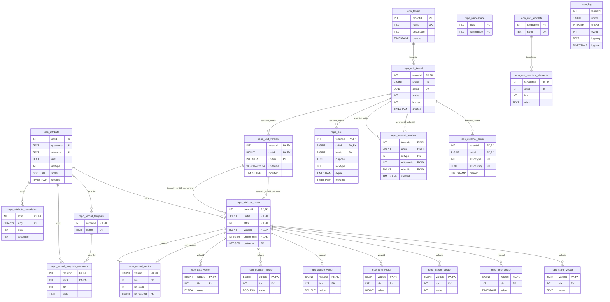

## The backing management system

The data model governed by this framework:

```mermaid
erDiagram
    repo_tenant {
        INT tenantid PK
        TEXT name UK
        TEXT description
        TIMESTAMP created
    }

    repo_unit_kernel {
        INT tenantid PK, FK
        BIGINT unitid PK
        UUID corrid UK
        INT status
        INT lastver
        TIMESTAMP created
    }

    repo_unit_version {
        INT tenantid PK, FK
        BIGINT unitid PK, FK
        INTEGER unitver PK
        VARCHAR(255) unitname
        TIMESTAMP modified
    }

    repo_namespace {
        TEXT alias PK
        TEXT namespace PK
    }

    repo_attribute {
        INT attrid PK
        TEXT qualname UK
        TEXT attrname UK
        TEXT alias
        INT attrtype
        BOOLEAN scalar
        TIMESTAMP created
    }

    repo_attribute_description {
        INT attrid PK, FK
        CHAR(2) lang PK
        TEXT alias
        TEXT description
    }

    repo_attribute_value {
        INT tenantid PK, FK
        BIGINT unitid PK, FK
        INT attrid PK, FK
        BIGINT valueid PK, UK
        INTEGER unitverfrom PK, FK
        INTEGER unitverto FK
    }

    repo_unit_template {
        INT templateid PK
        TEXT name UK
    }

    repo_unit_template_elements {
        INT templateid PK, FK
        INT attrid PK
        INT idx
        TEXT alias
    }

    repo_record_template {
        INT recordid PK, FK
        TEXT name UK
    }

    repo_record_template_elements {
        INT recordid PK, FK
        INT attrid PK, FK
        INT idx
        TEXT alias
    }

    repo_string_vector {
        BIGINT valueid PK, FK
        INT idx PK
        TEXT value
    }

    repo_time_vector {
        BIGINT valueid PK, FK
        INT idx PK
        TIMESTAMP value
    }

    repo_integer_vector {
        BIGINT valueid PK, FK
        INT idx PK
        INT value
    }

    repo_long_vector {
        BIGINT valueid PK, FK
        INT idx PK
        BIGINT value
    }

    repo_double_vector {
        BIGINT valueid PK, FK
        INT idx PK
        DOUBLE value
    }

    repo_boolean_vector {
        BIGINT valueid PK, FK
        INT idx PK
        BOOLEAN value
    }

    repo_data_vector {
        BIGINT valueid PK, FK
        INT idx PK
        BYTEA value
    }

    repo_record_vector {
        BIGINT valueid PK, FK
        INT idx PK
        INT ref_attrid
        BIGINT ref_valueid FK
    }

    repo_log {
        INT tenantid
        BIGINT unitid
        INTEGER unitver
        INT event
        TEXT logentry
        TIMESTAMP logtime
    }

    repo_lock {
        INT tenantid PK, FK
        BIGINT unitid PK, FK
        BIGINT lockid PK
        TEXT purpose
        INT locktype
        TIMESTAMP expire
        TIMESTAMP locktime
    }

    repo_internal_relation {
        INT tenantid PK, FK
        BIGINT unitid PK, FK
        INT reltype PK
        INT reltenantid PK, FK
        BIGINT relunitid PK, FK
        TIMESTAMP created
    }

    repo_external_assoc {
        INT tenantid PK, FK
        BIGINT unitid PK, FK
        INT assoctype PK
        TEXT assocstring PK
        TIMESTAMP created
    }

    repo_tenant ||--o{ repo_unit_kernel : "tenantid"
    repo_unit_kernel ||--o{ repo_unit_version : "tenantid, unitid"
    repo_attribute ||--o{ repo_attribute_description : "attrid"
    repo_attribute ||--o{ repo_attribute_value : "attrid"
    repo_unit_version ||--o{ repo_attribute_value : "tenantid, unitid, unitverfrom"
    repo_unit_version ||--o{ repo_attribute_value : "tenantid, unitid, unitverto"
    repo_unit_template ||--o{ repo_unit_template_elements : "templateid"
    repo_attribute ||--o{ repo_record_template : "recordid"
    repo_attribute ||--o{ repo_record_template_elements : "attrid"
    repo_record_template ||--o{ repo_record_template_elements : "recordid"
    repo_attribute_value ||--o{ repo_string_vector : "valueid"
    repo_attribute_value ||--o{ repo_time_vector : "valueid"
    repo_attribute_value ||--o{ repo_integer_vector : "valueid"
    repo_attribute_value ||--o{ repo_long_vector : "valueid"
    repo_attribute_value ||--o{ repo_double_vector : "valueid"
    repo_attribute_value ||--o{ repo_boolean_vector : "valueid"
    repo_attribute_value ||--o{ repo_data_vector : "valueid"
    repo_attribute_value ||--o{ repo_record_vector : "valueid"
    repo_attribute_value ||--o{ repo_record_vector : "ref_valueid"
    repo_unit_kernel ||--o{ repo_lock : "tenantid, unitid"
    repo_unit_kernel ||--o{ repo_internal_relation : "tenantid, unitid"
    repo_unit_kernel ||--o{ repo_internal_relation : "reltenantid, relunitid"
    repo_unit_kernel ||--o{ repo_external_assoc : "tenantid, unitid"
```
