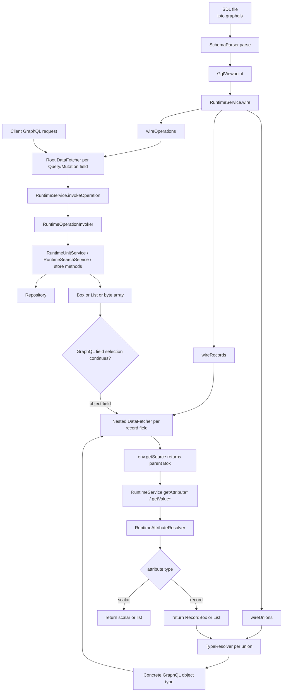

# GraphQL Runtime Flow: SDL -> Wiring -> RuntimeService -> Boxes

This note explains how a query or mutation defined in the SDL ends up in the Java runtime, and how `Box` instances are passed between root operation fetchers and nested field fetchers.

The short version is:

1. The SDL is parsed into a `TypeDefinitionRegistry`.
2. The runtime inspects that SDL and builds a `GqlViewpoint`.
3. `RuntimeService.wire(...)` auto-registers GraphQL Java fetchers and union resolvers from that shape information.
4. A root operation fetcher calls `RuntimeService.invokeOperation(...)`.
5. That returns either raw bytes or one or more `Box` objects.
6. Nested field fetchers receive the parent `Box` via `env.getSource()`, extract the correct attribute, and either return a scalar/list or manufacture a new child `Box`.

## 1. Bootstrap and Schema Assembly

At startup, Quarkus loads the configured SDL resource and hands it to `Configurator.load(...)`:

- `IptoBootstrap.init()` loads the SDL resource and calls `Configurator.load(repository, reader, this::wireOperations, ...)` in [implementations/java/repo-cdi/src/main/java/org/gautelis/ipto/bootstrap/IptoBootstrap.java](../implementations/java/repo-cdi/src/main/java/org/gautelis/ipto/bootstrap/IptoBootstrap.java#L71).
- `Configurator.load(...)` parses SDL, builds `RuntimeWiring`, derives the SDL view (`GqlViewpoint`), reconciles catalog state, creates `RuntimeService`, and asks it to wire GraphQL fetchers in [implementations/java/graphql/src/main/java/org/gautelis/ipto/graphql/configuration/Configurator.java](../implementations/java/graphql/src/main/java/org/gautelis/ipto/graphql/configuration/Configurator.java#L81).
- `RuntimeService.wire(...)` is just the coordination point that delegates to `RuntimeOperators.wireRecords(...)`, `wireUnions(...)`, and `wireOperations(...)` in [implementations/java/graphql/src/main/java/org/gautelis/ipto/graphql/runtime/service/RuntimeService.java](../implementations/java/graphql/src/main/java/org/gautelis/ipto/graphql/runtime/service/RuntimeService.java#L112).

That means the SDL is not only used to create the executable GraphQL schema. It is also used as input to synthesize the runtime fetchers.

## 2. Two Different Resolver Layers

There are really two resolver layers in play.

### 2.1 Root operation fetchers

These are GraphQL root fields on `Query` and `Mutation`. They are auto-wired in `RuntimeOperators.wireOperations(...)`:

- For each `GqlOperationShape`, a `DataFetcher` is registered on the GraphQL root type in [implementations/java/graphql/src/main/java/org/gautelis/ipto/graphql/runtime/wiring/RuntimeOperators.java](../implementations/java/graphql/src/main/java/org/gautelis/ipto/graphql/runtime/wiring/RuntimeOperators.java#L251).
- For normal query/mutation operations, that fetcher simply calls `runtimeService.invokeOperation(operation, env.getArguments())` in [implementations/java/graphql/src/main/java/org/gautelis/ipto/graphql/runtime/wiring/RuntimeOperators.java](../implementations/java/graphql/src/main/java/org/gautelis/ipto/graphql/runtime/wiring/RuntimeOperators.java#L280).

There is also a manual override hook:

- After the generic auto-wiring is installed, `Configurator.load(...)` invokes the caller-supplied `operationsWireBlock` in [implementations/java/graphql/src/main/java/org/gautelis/ipto/graphql/configuration/Configurator.java](../implementations/java/graphql/src/main/java/org/gautelis/ipto/graphql/configuration/Configurator.java#L112).
- In this application, `IptoBootstrap.wireOperations(...)` adds a domain-specific `Mutation.lagraYrkanRaw` fetcher that directly calls `params.runtimeService().storeDomainRawUnit(...)` in [implementations/java/repo-cdi/src/main/java/org/gautelis/ipto/bootstrap/IptoBootstrap.java](../implementations/java/repo-cdi/src/main/java/org/gautelis/ipto/bootstrap/IptoBootstrap.java#L104).

So the root-operation rule is:

- Most operations: SDL shape -> auto fetcher -> `RuntimeService.invokeOperation(...)`
- Special operations: manual CDI wiring -> bespoke fetcher -> `RuntimeService` method directly

### 2.2 Nested record field fetchers

These are the fetchers for fields inside SDL object types representing IPTO records.

- `RuntimeOperators.wireRecords(...)` iterates through every record type and every field in that record in [implementations/java/graphql/src/main/java/org/gautelis/ipto/graphql/runtime/wiring/RuntimeOperators.java](../implementations/java/graphql/src/main/java/org/gautelis/ipto/graphql/runtime/wiring/RuntimeOperators.java#L42).
- For each SDL field, it creates a closure that is later run by GraphQL Java.
- That closure does not look at root arguments. Instead, it reads `env.getSource()`, which is expected to be a `Box` representing the parent object currently being resolved in [implementations/java/graphql/src/main/java/org/gautelis/ipto/graphql/runtime/wiring/RuntimeOperators.java](../implementations/java/graphql/src/main/java/org/gautelis/ipto/graphql/runtime/wiring/RuntimeOperators.java#L127)

This is the key separation:

- Root fetchers start from GraphQL arguments.
- Nested field fetchers start from a parent `Box`.

## 3. What the Boxes Actually Represent

The `Box` hierarchy is a lightweight adapter between the repository model and GraphQL Java.

### 3.1 `Box`

`Box` is the common base type and mainly carries the owning `Unit`:

- See [implementations/java/graphql/src/main/java/org/gautelis/ipto/graphql/runtime/box/Box.java](../implementations/java/graphql/src/main/java/org/gautelis/ipto/graphql/runtime/box/Box.java#L23).

Every child box keeps the same `Unit`, which is why nested resolvers still know which unit they belong to.

### 3.2 `AttributeBox`

`AttributeBox` is a mapping from GraphQL field name or alias to repository `Attribute<?>`:

- See [implementations/java/graphql/src/main/java/org/gautelis/ipto/graphql/runtime/box/AttributeBox.java](../implementations/java/graphql/src/main/java/org/gautelis/ipto/graphql/runtime/box/AttributeBox.java#L29).

This is typically the box used for a top-level loaded unit. `UnitBoxFactory.fromUnit(...)` builds it by indexing the unit's attributes by alias:

- [implementations/java/graphql/src/main/java/org/gautelis/ipto/graphql/runtime/box/UnitBoxFactory.java](../implementations/java/graphql/src/main/java/org/gautelis/ipto/graphql/runtime/box/UnitBoxFactory.java#L25).

### 3.3 `RecordBox`

`RecordBox` extends `AttributeBox` and additionally remembers the record attribute from which it was created:

- [implementations/java/graphql/src/main/java/org/gautelis/ipto/graphql/runtime/box/RecordBox.java](../implementations/java/graphql/src/main/java/org/gautelis/ipto/graphql/runtime/box/RecordBox.java#L26).

That extra `recordAttribute` is what makes union resolution possible later, because the union resolver looks at that record attribute alias to decide which concrete GraphQL object type to expose.

## 4. Root Operation Dispatch in `RuntimeService`

`RuntimeService` is the central entry point used by the auto-wired root operation fetchers:

- `invokeOperation(...)` delegates to `RuntimeOperationInvoker` in [implementations/java/graphql/src/main/java/org/gautelis/ipto/graphql/runtime/service/RuntimeService.java](../implementations/java/graphql/src/main/java/org/gautelis/ipto/graphql/runtime/service/RuntimeService.java#L122).
- `RuntimeOperationInvoker` coerces GraphQL argument maps into typed runtime records such as `Query.UnitIdentification` and `Query.Filter` in [implementations/java/graphql/src/main/java/org/gautelis/ipto/graphql/runtime/service/RuntimeOperationInvoker.java](../implementations/java/graphql/src/main/java/org/gautelis/ipto/graphql/runtime/service/RuntimeOperationInvoker.java#L147).
- It then maps the SDL operation to one of a small set of runtime actions:
  - load unit by `(tenantId, unitId)`
  - load unit by `(tenantId, corrId)`
  - search by filter
  - store raw unit
  - return raw bytes instead of boxed unit results

The main routing logic is in [implementations/java/graphql/src/main/java/org/gautelis/ipto/graphql/runtime/service/RuntimeOperationInvoker.java](../implementations/java/graphql/src/main/java/org/gautelis/ipto/graphql/runtime/service/RuntimeOperationInvoker.java#L41).

The important thing for the box story is the return type:

- `loadUnit(...)` and `loadUnitByCorrId(...)` return `Box`
- `search(...)` returns `List<Box>`
- raw operations return `byte[]`
- store operations may return `byte[]` or validation payloads

That means only some root operations produce a GraphQL object tree that needs nested field resolution. Those are the ones returning `Box` or `List<Box>`.

## 5. Where the First Box Comes From

When a root operation loads a unit, `RuntimeUnitService` fetches the repository `Unit` and wraps it in an `AttributeBox`:

- `loadUnit(...)` and `loadUnitByCorrId(...)` call `UnitBoxFactory.fromUnit(unit)` in [implementations/java/graphql/src/main/java/org/gautelis/ipto/graphql/runtime/service/RuntimeUnitService.java](../implementations/java/graphql/src/main/java/org/gautelis/ipto/graphql/runtime/service/RuntimeUnitService.java#L41).

That is the first box GraphQL Java sees as the value of the root field.

From then on, GraphQL Java passes that box as `env.getSource()` when resolving child fields below that root object.

## 6. How a Nested Field Is Resolved

This is the most fiddly part, but it is still conceptually simple.

### 6.1 Wiring time: build a fetcher closure per SDL field

For each SDL field, `RuntimeOperators.wireRecords(...)` precomputes:

- the GraphQL field name
- the backing attribute name
- whether the field is scalar or array
- whether the field is mandatory
- a list of candidate attribute aliases called `fieldNames`

See [implementations/java/graphql/src/main/java/org/gautelis/ipto/graphql/runtime/wiring/RuntimeOperators.java](../implementations/java/graphql/src/main/java/org/gautelis/ipto/graphql/runtime/wiring/RuntimeOperators.java#L72).

That `fieldNames` list is important. It is the runtime fallback list used to find the underlying repository attribute. Usually it contains the direct alias for the field. For union-typed fields it also includes aliases for each union member record type.

### 6.2 Runtime: GraphQL invokes the closure with a parent source object

When the field is actually requested, the fetcher:

1. Reads `env.getSource()`
2. Requires it to be a `Box`
3. Distinguishes between `AttributeBox` and `RecordBox`
4. Calls the matching `RuntimeService` helper

This branch is in [implementations/java/graphql/src/main/java/org/gautelis/ipto/graphql/runtime/wiring/RuntimeOperators.java](../implementations/java/graphql/src/main/java/org/gautelis/ipto/graphql/runtime/wiring/RuntimeOperators.java#L127).

The meaning of the branch is:

- `AttributeBox`: resolve among top-level unit attributes
- `RecordBox`: resolve among attributes inside one nested record value

### 6.3 `RuntimeAttributeResolver` does the lookup

The actual lookup happens in `RuntimeAttributeResolver`:

- `resolveFromAttributeBox(...)` searches the current box map by alias in [implementations/java/graphql/src/main/java/org/gautelis/ipto/graphql/runtime/service/RuntimeAttributeResolver.java](../implementations/java/graphql/src/main/java/org/gautelis/ipto/graphql/runtime/service/RuntimeAttributeResolver.java#L125).
- `resolveFromRecord(...)` scans the nested record attribute contents in [implementations/java/graphql/src/main/java/org/gautelis/ipto/graphql/runtime/service/RuntimeAttributeResolver.java](../implementations/java/graphql/src/main/java/org/gautelis/ipto/graphql/runtime/service/RuntimeAttributeResolver.java#L99).

After it has found the target attribute, it decides whether to return:

- a scalar
- a scalar list
- a newly created `RecordBox`
- a list of child `Box` objects

That conversion happens in [implementations/java/graphql/src/main/java/org/gautelis/ipto/graphql/runtime/service/RuntimeAttributeResolver.java](../implementations/java/graphql/src/main/java/org/gautelis/ipto/graphql/runtime/service/RuntimeAttributeResolver.java#L175).

This is the core box-passing loop:

- parent `Box` comes in through `env.getSource()`
- resolver finds an `Attribute<?>`
- if the attribute is scalar-like, return plain value(s)
- if the attribute is a record, create one or more child boxes
- GraphQL Java uses those child boxes as `env.getSource()` for the next selection level

## 7. Union Handling

Union fields are the one place where the runtime needs extra type-discrimination help.

At wiring time:

- `wireRecords(...)` detects that a field type is a union and expands `fieldNames` with aliases for all union member record types in [implementations/java/graphql/src/main/java/org/gautelis/ipto/graphql/runtime/wiring/RuntimeOperators.java](../implementations/java/graphql/src/main/java/org/gautelis/ipto/graphql/runtime/wiring/RuntimeOperators.java#L102).

At execution time:

- `wireUnions(...)` has already registered a `TypeResolver` for the GraphQL union in [implementations/java/graphql/src/main/java/org/gautelis/ipto/graphql/runtime/wiring/RuntimeOperators.java](../implementations/java/graphql/src/main/java/org/gautelis/ipto/graphql/runtime/wiring/RuntimeOperators.java#L191).
- That resolver expects the runtime value to be a `RecordBox`.
- It looks at `recordBox.getRecordAttribute().getAlias()`, maps that alias to a concrete GraphQL object type, and returns `env.getSchema().getObjectType(typeName)` in [implementations/java/graphql/src/main/java/org/gautelis/ipto/graphql/runtime/wiring/RuntimeOperators.java](../implementations/java/graphql/src/main/java/org/gautelis/ipto/graphql/runtime/wiring/RuntimeOperators.java#L226).

So unions work because `RecordBox` preserves the identity of the record attribute that produced it.

## 8. End-to-End Sequence

## 9. Practical Mental Model

The code becomes easier to read if you keep this model in mind:

- The SDL describes the public GraphQL shape.
- `Configurator` converts that shape into internal `Gql*Shape` metadata.
- `RuntimeOperators` uses that metadata to prebuild GraphQL Java closures.
- Root closures call runtime services using GraphQL arguments.
- Field closures call runtime services using the parent `Box`.
- A `Box` is just the transport object that carries enough repository context to let the next resolver step continue.

The runtime is not deeply complicated, but keep in that there are two kinds of transitions:

- GraphQL arguments -> runtime service call -> initial `Box`
- parent `Box` -> attribute lookup -> child scalar or child `Box`

Once that split is clear, the rest of the machinery is mostly alias lookup and record wrapping.

## 10. File Map

The main files for this flow are:

- SDL bootstrap: [implementations/java/repo-cdi/src/main/java/org/gautelis/ipto/bootstrap/IptoBootstrap.java](../implementations/java/repo-cdi/src/main/java/org/gautelis/ipto/bootstrap/IptoBootstrap.java)
- SDL parsing and executable schema assembly: [implementations/java/graphql/src/main/java/org/gautelis/ipto/graphql/configuration/Configurator.java](../implementations/java/graphql/src/main/java/org/gautelis/ipto/graphql/configuration/Configurator.java)
- auto-wiring of fields, unions, and operations: [implementations/java/graphql/src/main/java/org/gautelis/ipto/graphql/runtime/wiring/RuntimeOperators.java](../implementations/java/graphql/src/main/java/org/gautelis/ipto/graphql/runtime/wiring/RuntimeOperators.java)
- runtime facade: [implementations/java/graphql/src/main/java/org/gautelis/ipto/graphql/runtime/service/RuntimeService.java](../implementations/java/graphql/src/main/java/org/gautelis/ipto/graphql/runtime/service/RuntimeService.java)
- root operation dispatch: [implementations/java/graphql/src/main/java/org/gautelis/ipto/graphql/runtime/service/RuntimeOperationInvoker.java](../implementations/java/graphql/src/main/java/org/gautelis/ipto/graphql/runtime/service/RuntimeOperationInvoker.java)
- attribute-to-value and attribute-to-box conversion: [implementations/java/graphql/src/main/java/org/gautelis/ipto/graphql/runtime/service/RuntimeAttributeResolver.java](../implementations/java/graphql/src/main/java/org/gautelis/ipto/graphql/runtime/service/RuntimeAttributeResolver.java)
- root box creation: [implementations/java/graphql/src/main/java/org/gautelis/ipto/graphql/runtime/service/RuntimeUnitService.java](../implementations/java/graphql/src/main/java/org/gautelis/ipto/graphql/runtime/service/RuntimeUnitService.java)
- box hierarchy: [implementations/java/graphql/src/main/java/org/gautelis/ipto/graphql/runtime/box/Box.java](../implementations/java/graphql/src/main/java/org/gautelis/ipto/graphql/runtime/box/Box.java), [implementations/java/graphql/src/main/java/org/gautelis/ipto/graphql/runtime/box/AttributeBox.java](../implementations/java/graphql/src/main/java/org/gautelis/ipto/graphql/runtime/box/AttributeBox.java), [implementations/java/graphql/src/main/java/org/gautelis/ipto/graphql/runtime/box/RecordBox.java](../implementations/java/graphql/src/main/java/org/gautelis/ipto/graphql/runtime/box/RecordBox.java), [implementations/java/graphql/src/main/java/org/gautelis/ipto/graphql/runtime/box/UnitBoxFactory.java](../implementations/java/graphql/src/main/java/org/gautelis/ipto/graphql/runtime/box/UnitBoxFactory.java)
